# 일본 앱테크 리워드/은행계좌 벤치마킹 보고서

확인일: 2026-06-09  
목적: 일본 앱테크/포이활 서비스가 고객 리워드를 어떤 방식으로 제공하는지, 고객이 무엇을 입력해야 하는지, 운영상 무엇을 준비해야 하는지 정리한다.

## 0. 보고서 목업

```text
[일본 앱테크 리워드 벤치마킹 보고서]

1. 결론
   - 일본 진출 초기: 기프트/PayPay/포인트 교환 우선
   - 은행송금: 가능하지만 후순위, 운영 난도 높음

2. 벤치마킹 대상
   - 한국계/글로벌 진출 앱: Cashwalk JP, Moneywalk JP, TikTok Lite
   - 일본 성공 앱: トリマ, クラシルリワード, Powl, ONE, aruku&, CODE, Uvoice
   - 현금화 중심 사이트: ハピタス, モッピー, ポイントタウン, GMOポイ活

3. 리워드 방식
   - 기프트코드/디지털기프트
   - PayPay Money Light/주요 포인트
   - DotMoney/교환 플랫폼
   - 은행송금
   - 쿠폰/현물

4. 각 방식별
   - 사용자 입력값
   - 워크플로우
   - 장점/단점
   - 운영 체크리스트
   - 한국과 다른 점
```

## 1. 결론

이번 검증의 핵심 질문은 **“일본 은행송금에서 은행명과 지점명을 같이 받는 것이 맞는가?”**였다. 결론은 맞다. 일본 계좌이체/은행송금은 은행명만으로 부족하고 `은행명 또는 금융기관코드` + `지점명 또는 지점코드` + `계좌종류` + `계좌번호` + `계좌명의カナ`를 함께 받는 구조가 일반적이다.

은행과 지점은 수가 많기 때문에 전체 드롭다운 나열보다 `주요 은행 빠른 선택` + `은행명/금융기관코드 검색` + `지점명/지점코드 검색` 방식이 적합하다. Zengin-Net 통계는 2026년 3월 기준 금융기관 1,086개, 지점 29,010개를 집계하고 있으며, 대형은행은 지점이 300개를 넘는 사례도 확인된다.

계좌유형은 일본 송금/계좌 폼에서 보통 `普通預金(일반/보통예금)`, `当座預金(당좌/수표성 계좌)`, `貯蓄預金(저축예금)`을 다룬다. 앱테크 출금 신청 페이지에서는 기본값을 `普通預金(일반/보통예금)`으로 두고, `当座預金(당좌/수표성 계좌)`, `貯蓄預金(저축예금)`은 필요 시 선택 옵션으로 제공하는 구성이 좋다. 사용자에게는 “대부분의 개인 계좌는 普通預金(일반/보통예금)을 선택”이라고 명확히 안내해야 한다.

다만 서비스 전략상 은행송금은 본인명의 계좌, 명의カナ(계좌명의 가나 표기), ゆうちょ銀行(우체국은행) 예외, 계좌오류/반려, 송금 수수료, CS 부담이 크다. 따라서 일본 앱테크 MVP는 은행계좌 입력보다 `PayPay`, `Amazonギフト`, `dポイント`, `Ponta`, `楽天ポイント`, `Vポイント` 같은 생활권 포인트/기프트 교환을 먼저 제공하는 편이 안전하다. 실제 벤치마킹에서도 Cashwalk JP, Moneywalk JP, トリマ, クラシルリワード, Powl, TikTok Lite는 은행송금보다 포인트/기프트 교환을 더 전면에 둔다.

**핵심 결론**

일본에서 은행송금을 제공하려면 은행명과 지점명/지점코드를 같이 선택받는 형태가 맞다. 계좌유형은 화면에 명확히 표시하되 기본은 `普通預金(일반/보통예금)`으로 두고, `当座預金(당좌/수표성 계좌)`, `貯蓄預金(저축예금)`은 필요 시 선택 옵션으로 제공하는 것이 좋다. 다만 초기 앱테크 리워드는 은행송금보다 PayPay/Amazonギフト(Amazon 기프트)/주요 포인트 교환을 먼저 제공하는 사례가 더 많다.

## 2. 벤치마킹 대상과 리워드 방식

| 서비스 | 성공/확산 신호 | 리워드 제공 방식 | 은행계좌 입력 | 참고 포인트 |
|---|---:|---|---|---|
| Cashwalk JP | 한국계 헬스케어 앱 일본 진출 | 기프트카드/기프트코드 | 없음 | 걷기 앱 MVP는 기프트 중심 가능 |
| Moneywalk JP | App Store 6만+ 평점권 | DotMoney 경유, 기프트카드 | 외부 경유 가능 | Shop → DotMoney → PayPay/은행송금 |
| TikTok Lite | App Store 90만+ 평점권 | PayPayポイント, えらべるPay, 주요 포인트 | 없음 | 일본 리워드 앱의 대형 성공 사례 |
| トリマ | 일본 대표 이동/걷기 포이활 | Digital Gift, PayPay, Amazon, Vポイント 등 | 후순위/외부 경유 | 이동형 앱의 강한 벤치마크 |
| クラシルリワード | 누적 1,000만 다운로드 표기 | PayPay, Amazon, d/Ponta/Rakuten/Vポイント, 쿠폰 | 없음 | 생활/레시트/이동형 교환처 구성 참고 |
| Powl | 350만+ 유저 공지 | PayPay Money Light, Amazon, 전자머니, 현금 등 | 외부/현금 가능 | PayPay 공식 API 연계 사례 |
| ONE | 레시트 매입 앱, 200만+ 다운로드 후기 | 현금/티켓/쿠폰 | 현금 출금 시 계좌 | 레시트형은 현금 니즈가 강함 |
| aruku& | 걷기 포이활 | DotMoney | 외부 경유 가능 | 걷기 앱도 직접 송금보다 DotMoney 경유 |
| CODE | 레시트 포이활 | DotMoney | 외부 경유 가능 | 레시트형 교환처 확장 사례 |
| Uvoice | 설문/행동데이터 | デジコ, ドットギフト, DotMoney, PayPay | 외부 경유 가능 | 교환처별 플랫폼 조합 |
| ハピタス | 대형 포인트사이트 | 직접 은행송금/기프트/포인트 | 있음 | 현금화 UX 참고 |
| モッピー | 대형 포인트사이트 | 은행송금, PayPal, ATM, 포인트/기프트 | 있음 | 현금 교환처 다양 |
| ポイントタウン | GMO 계열 포인트사이트 | 은행송금, 디지털기프트, 포인트 | 있음 | 본인명의/계좌 제한 정책 참고 |
| GMOポイ活 | GMO 계열 포이활 | 직접 현금 교환 | 있음 | 은행/지점 검색형 UX 참고 |

## 3. 실제 리워드 관련 화면

### 3.1 Cashwalk JP: 기프트 중심

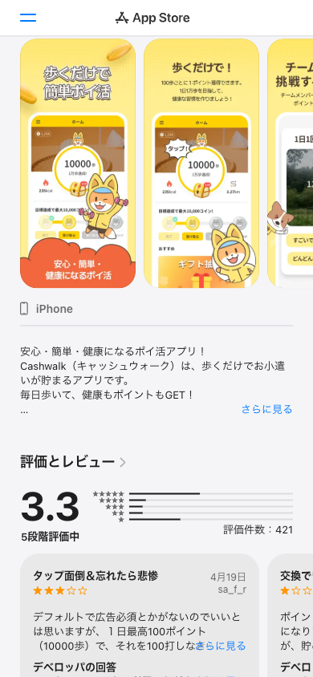

**보이는 점**

- 일본판 Cashwalk는 현금 송금 화면이 아니라 기프트카드 교환 흐름이 핵심이다.
- App Store 설명 기준 현금 환전은 비대응이며, 교환 탭에서 기프트카드/기프트코드를 지급한다.
- 공식 FAQ 기준 무료로 모은 코인은 타사 포인트나 기프트카드로 교환할 수 있고, 예시로 Amazonギフト券(Amazon 기프트권), dポイント(d포인트), スターバックスギフト券(스타벅스 기프트권), Pontaポイント(Ponta 포인트)가 언급된다.
- 교환/응모로 획득한 기프트카드는 앱 내 `Myギフトカード(My기프트카드)`에서 확인한다. 접근 위치는 `交換(교환)` 탭 우측 상단 티켓 아이콘 또는 홈 좌측 메뉴의 Myギフトカード다.
- 교환 실패 시 보안 장치가 일시적으로 교환을 제한할 수 있고, 연속 탭/반복 조작을 피하고 몇 시간 뒤 재시도하라고 안내한다.

**Workflow**

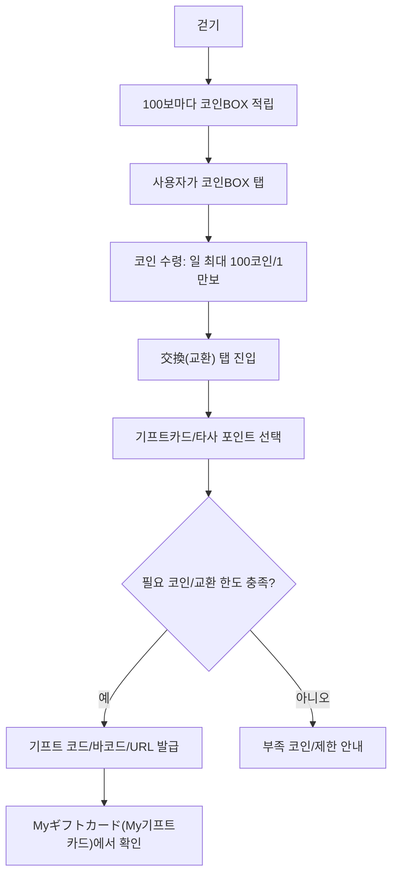

**전환 구조**

| 단계 | 사용자 행동 | 시스템/운영 처리 |
|---|---|---|
| 적립 | 걷고 코인BOX를 탭 | 걸음수 기반 무료 코인 적립, 일 최대치 관리 |
| 교환 신청 | 交換(교환) 탭에서 기프트/포인트 선택 | 필요 코인, 재고, 교환횟수 제한, 부정사용 여부 확인 |
| 지급 | 조건 충족 시 코드/바코드/URL 발급 | 기프트 코드 발급, 지급 상태 저장, Myギフトカード 노출 |
| 사용 | 사용자가 각 서비스에 코드 입력 또는 바코드 사용 | Amazon/d/Ponta 등 외부 서비스 계정에서 사용. Cashwalk는 외부 계정 비밀번호를 보관하지 않음 |
| CS | 미수신/교환 실패/기기변경 문의 | Myギフトカード, 계정 로그인 정보, 등록 메일/전화번호 인증 여부로 추적 |

### 3.2 Moneywalk JP: Shop → DotMoney 경유

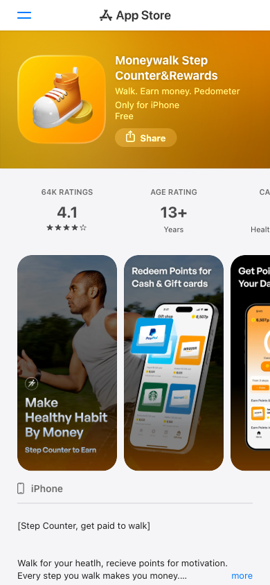

**보이는 점**

- Moneywalk는 앱 화면에서 Cash & Gift cards 교환을 전면에 둔다.
- 은행송금은 앱이 계좌를 직접 받기보다 DotMoney 경유 구조이며, DotMoney 도움말에서 Shop → 포인트/특전 교환 → ID 연동 흐름이 확인된다.

**Workflow**

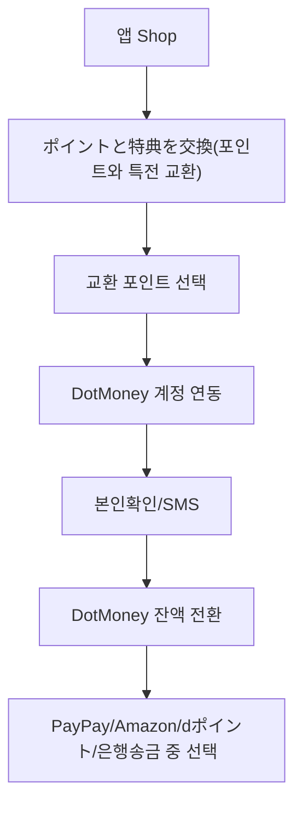

### 3.3 クラシルリワード: 선택형 특전 교환

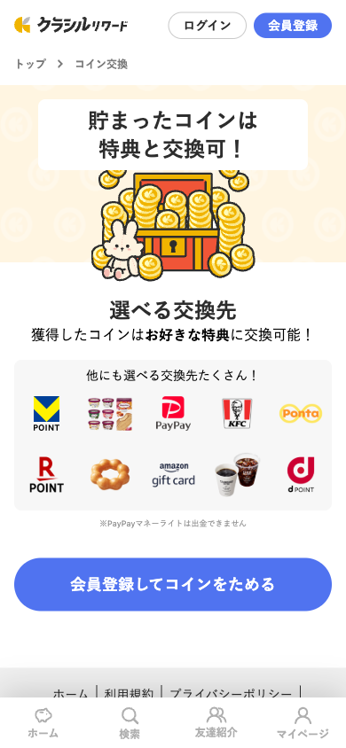

**보이는 점**

- `貯まったコインは特典と交換可(모은 코인은 특전으로 교환 가능)` 메시지와 함께 PayPay, Amazonギフト(Amazon 기프트), dポイント(d포인트), Ponta, 楽天ポイント(라쿠텐 포인트), Vポイント(V포인트), 쿠폰형 상품이 함께 노출된다.
- PayPay Money Light는 출금 불가라는 주의 문구가 붙는다.

**Workflow**

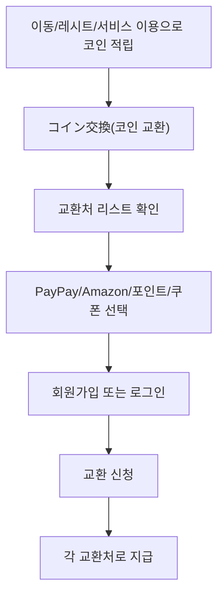

### 3.4 Powl: PayPay Money Light 연동

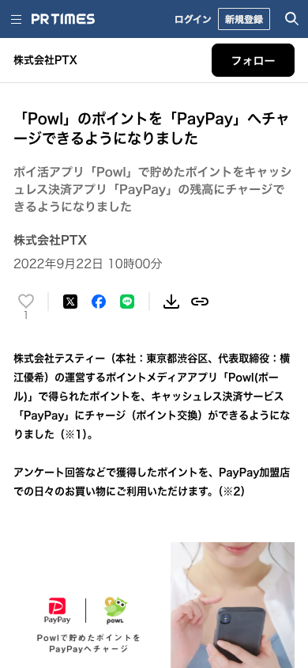

**보이는 점**

- Powl 포인트를 PayPay 잔액으로 충전/교환하는 공식 연동 사례다.
- PayPay Money Light는 일본 내 사용성이 높지만 출금 불가 성격을 사용자에게 알려야 한다.

**Workflow**

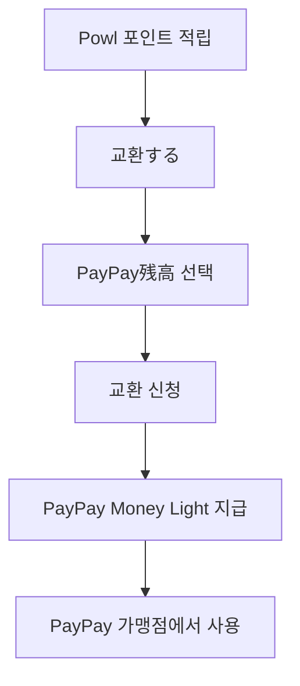

### 3.5 TikTok Lite: 대형 리워드 앱 사례

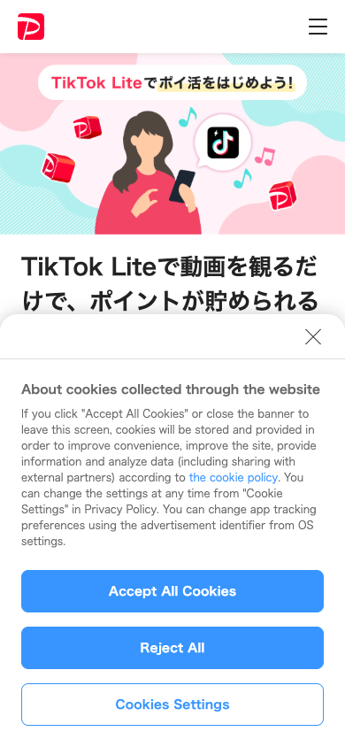

**보이는 점**

- PayPay 공식 기사에서 TikTok Lite는 동영상 시청만으로 포인트를 모으고 PayPayポイント(PayPay 포인트) 등으로 교환 가능한 앱으로 소개된다.
- 일본에서는 “현금”보다 `PayPay/楽天(라쿠텐)/d/Ponta/Vポイント(V포인트)` 같은 생활권 포인트가 고객 체감 가치가 높다.

**Workflow**

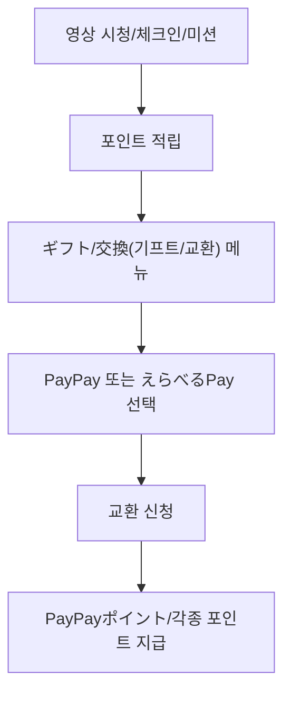

### 3.6 ハピタス: 직접 은행송금

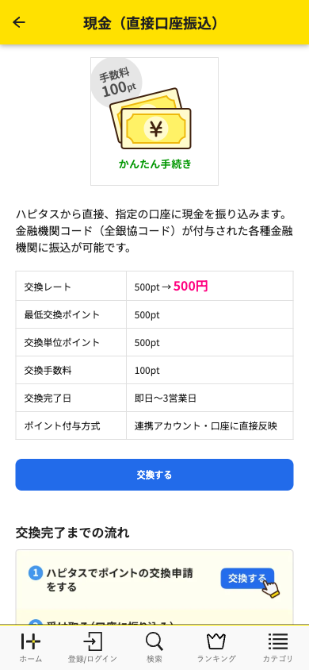

**보이는 점**

- `現金（直接口座振込, 현금/직접 계좌입금）` 상품이 명확하다.
- 교환 수수료, 최소 교환 포인트, 교환 완료일이 표로 안내된다.
- 로그인 이후 지정 계좌 등록/교환 신청으로 이어진다.

**Workflow**

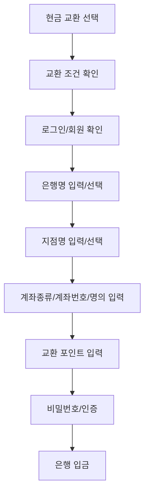

### 3.7 ポイントタウン: 은행별 현금 교환 페이지

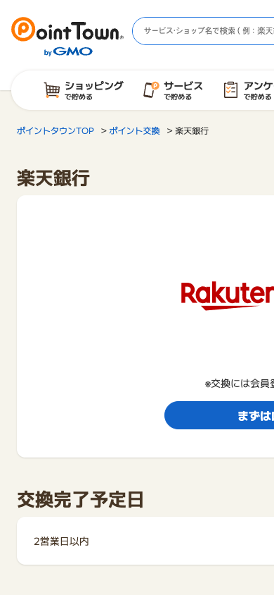

**보이는 점**

- 은행별 교환 페이지를 제공한다.
- 완료 예정일, 조건, 회원 등록 필요 여부가 노출된다.
- 본인명의/1계좌/계좌 변경 제한 같은 운영 정책이 중요하다.

**Workflow**

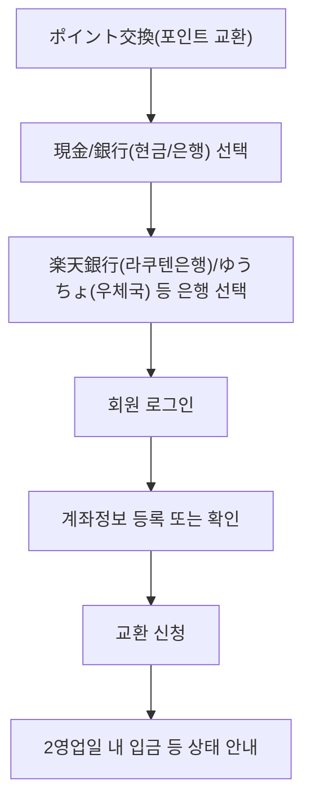

### 3.8 GMOポイ活: 은행/지점 검색형 계좌 입력

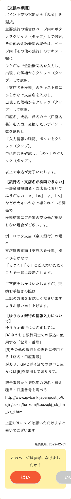

**보이는 점**

- 공개 도움말에 `주요 은행 버튼`, `기타 은행 검색`, `支店名を検索(지점명 검색)` 흐름이 안내된다.
- 실제 입력 폼은 로그인 뒤라 공개 캡처가 제한된다.

**Workflow**

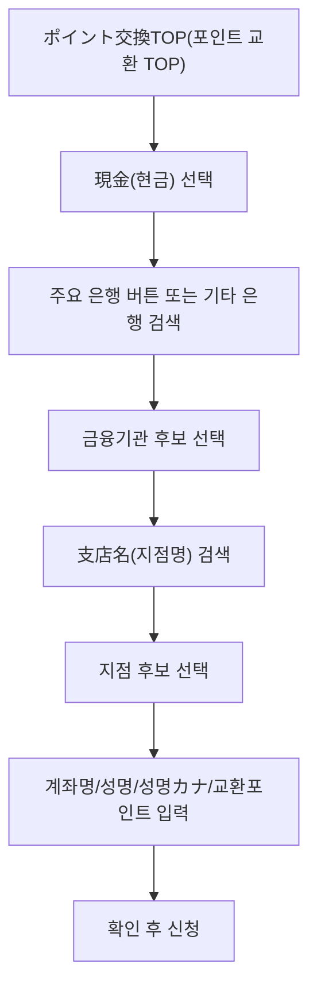

## 4. 고객 리워드 방식별 비교

| 방식 | 고객이 입력하는 것 | 장점 | 단점 | 운영 요구사항 |
|---|---|---|---|---|
| 기프트코드 직접 지급 | 교환처 선택, 포인트 사용 확인 | UX 빠름, 은행계좌 불필요, MVP 쉬움 | 코드 재고/만료/중복지급 리스크 | 코드 발급/보관/재발급/CS |
| デジコ/giftee Box/えらべるPay | 휴대폰/메일/외부 교환 페이지 | 교환처 많음, 코드 재고 부담 감소 | 외부 화면 이동, 수수료/계약 필요 | API 계약, 콜백, 만료/재발급 정책 |
| PayPay Money Light | PayPay 연동 또는 교환 신청 | 일본 사용성 매우 높음, 체감 가치 큼 | 출금 불가 안내 필요, API/심사 필요 | PayPay 연동, 지급 상태, 실패 처리 |
| DotMoney/PeX/Gポイント | 외부 계정 ID, SMS/본인확인 | 은행송금/포인트/기프트 확장 쉬움 | 앱 내 UX 통제 약함 | 외부 전환 상태, 안내/문의 분리 |
| 은행송금 | 은행명, 지점명, 계좌종류, 계좌번호, 명의カナ | 현금화 니즈 충족 | 수수료, 계좌오류, 본인명의, 조합/반려 CS | 계좌체크, 송금 API, 부정방지, 재신청 |
| 쿠폰/현물 | 상품 선택, 경우에 따라 바코드/주소 | 사용 목적이 명확함 | 상품별 재고/유효기간/제휴관리 | 쿠폰 사용상태, 만료, 제휴사 정산 |

## 5. 한국과 일본의 차이

| 항목 | 한국 앱테크 관성 | 일본 포이활 관성 | 설계 시사점 |
|---|---|---|---|
| 리워드 체감 | 현금, 네이버페이, 카카오페이, 모바일상품권이 직관적 | PayPay, Amazonギフト(Amazon 기프트), dポイント(d포인트), Ponta, 楽天ポイント(라쿠텐 포인트), Vポイント(V포인트) 등 생활권 포인트 체감이 큼 | 1차 MVP는 현금보다 즉시 쓸 수 있는 교환처를 앞에 배치 |
| 교환처 구조 | 앱이 직접 쿠폰/상품권을 지급하거나 국내 포인트로 전환 | DotMoney, デジコ, giftee Box, えらべるPay 같은 중간 교환 플랫폼 경유가 많음 | 직접 제휴보다 플랫폼 제휴로 교환처를 빠르게 넓히는 전략 유리 |
| PayPay 성격 | 간편결제 포인트는 현금성으로 오해되기 쉬움 | PayPay Money Light는 사용처는 넓지만 출금 불가 조건이 중요 | “현금 출금 불가/가맹점 사용”을 교환 전 명확히 표시 |
| 계좌 입력 | 은행 선택 + 계좌번호 + 예금주 정도가 익숙하고 지점명 입력은 드묾 | 은행명/금융기관코드 + 지점명/지점코드 + 계좌종류 + 계좌번호 + 명의カナ가 필요 | 은행 검색, 지점 검색, カナ 입력, 계좌종류 선택 UI가 필요 |
| ゆうちょ銀行(우체국은행) | 우체국 계좌도 일반 은행 계좌와 유사하게 처리 | ゆうちょ銀行(우체국은행)은 기호/번호와 송금용 店名(점명/지점명), 預金種目(예금종류), 口座番号(계좌번호) 변환 이슈가 있음 | ゆうちょ(우체국은행) 선택 시 별도 안내와 변환 도움말을 보여줘야 함 |
| 본인확인 | 휴대폰 본인인증/CI 기반 흐름이 익숙 | SMS, 메일, 외부 포인트 계정, eKYC, 계좌명의カナ 일치 확인을 조합 | 기프트 MVP는 낮은 인증, 은행송금은 본인명의/eKYC 강화로 단계화 |
| 계좌 인증 | 계좌실명조회/간편인증 경험을 기대하기 쉬움 | 은행/지점 마스터 검증과 실제 명의/계좌 유효성 검증은 별도 솔루션 영역 | Bankcode류는 검색용, 계좌 검증/송금 결과는 송금대행 API로 분리 |
| 수수료/완료일 | 즉시 지급/무료 교환 기대가 큼 | 교환처별 최소 포인트, 수수료, 영업일 지급, 반려 수수료가 흔함 | 교환 리스트와 확인 화면에 수수료/완료 예정일을 항상 노출 |
| 개인정보 인식 | 서비스 약관/개인정보처리방침은 한국 양식 재사용 유혹이 큼 | 일본어 이용목적, 제3자 제공, 위탁, 국외 이전, 문의창구 고지가 중요 | 일본 전용 プライバシーポリシー/利用規約를 별도 작성 |
| 광고/리워드 표시 | “돈 버는 앱”, “하루 N원” 식 표현을 쓰기 쉬움 | 조건 누락, 과장 보상, 추천/리뷰 보상은 景品表示法 리스크가 있음 | 최대치보다 평균/조건/제한을 명확히 표기 |
| CS/운영 | 국내 간편결제/상품권 CS 패턴을 재사용 가능 | 외부 교환처 계정 연동, 교환 실패, 메일 미수신, 계좌 반려, カナ 오류 CS가 큼 | 교환 상태값과 실패 사유를 세분화하고 도움말을 일본어로 준비 |

제품 방향:

일본 초기 진출은 `은행송금 앱`보다 `포인트/기프트 교환 앱`으로 인식시키는 편이 안전하다. UI는 PayPay/Amazon/dポイント/Ponta 같은 생활권 교환처를 먼저 보여주고, 은행송금은 충분한 부정방지·본인확인·송금대행 구조가 잡힌 뒤 확장하는 것이 좋다.

## 6. 일본 진출 초기 추천안

워크플로우는 1차/2차/3차 출시 단계로 고정하기보다 `기본 교환 흐름`, `외부 교환 플랫폼 경유`, `은행송금 추가 흐름`으로 나누는 편이 낫다. 초기 화면은 기본 포인트/기프트 교환만 단순하게 제공하고, DotMoney/デジコ/giftee 같은 외부 교환 플랫폼이나 은행송금은 운영·법무·CS 준비가 된 뒤 붙이는 옵션으로 둔다.

### 기본 포인트/기프트 교환 흐름

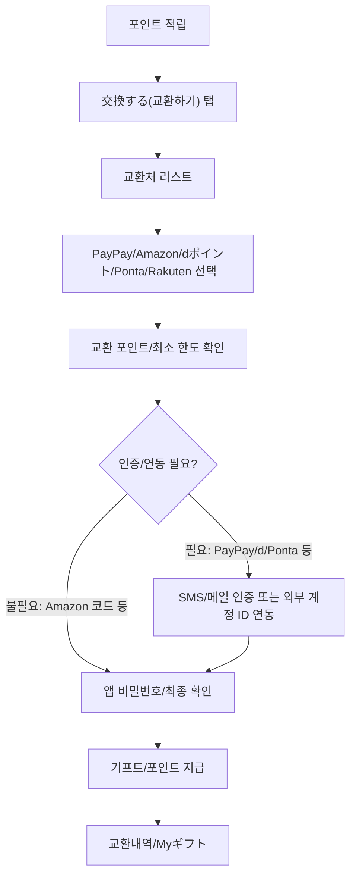

**고객 입력값**

- 교환처 선택
- 교환 포인트
- 앱 비밀번호 또는 최종 확인
- 교환처별 외부 계정 ID: PayPay, dアカウント, Ponta ID 등
- 필요 시 SMS/메일 인증

**교환처별 인증 방식**

| 교환처 | 인증/연동 방식 | UX 처리 |
|---|---|---|
| Amazonギフトカード | Amazon 계정 연동은 보통 불필요. 앱 로그인 상태 + 앱 비밀번호/메일 확인 | 코드 즉시 발급 후 Myギフト에 보관. 코드 발급/열람 로그로 CS 추적 |
| PayPay Money Light | PayPay 계정 확인 또는 제휴 API/외부 링크 연동, 필요 시 SMS | 출금 불가와 PayPay 계정 지급 조건을 교환 전 표시 |
| dポイント(d포인트)/Ponta/楽天(라쿠텐)/Vポイント(V포인트) | 외부 포인트 계정 ID 연동 또는 번호 입력, SMS/메일 확인 가능 | 최초 1회 연동 후 다음 교환부터 저장 계정 사용 |
| デジコ/giftee/えらべるPay | 앱에서 교환 신청 후 외부 선택 링크 발급, 메일/SMS 발송 가능 | 외부 페이지에서 사용자가 교환처를 직접 선택. URL 발급/열람/사용 상태 추적 |

**앱 계정과 외부 플랫폼 계정의 역할**

| 방식 | 사용자 가입/연동 | 우리가 보관할 것 | 우리가 보관하지 않는 것 |
|---|---|---|---|
| Amazon 기프트 코드 | 사용자는 Amazon 계정 없이도 코드를 받을 수 있고, 사용 시 본인 Amazon 계정에 등록 | 우리 앱 회원ID, 주문ID, 발급 코드/URL, 열람 로그, 재발급/취소 상태 | 사용자의 Amazon 로그인 정보/비밀번호 |
| PayPay/d/Ponta 등 포인트 | 사용자가 해당 외부 계정을 보유하거나 최초 1회 연동/ID 입력 | 외부 계정 식별자 일부, 연동 토큰 또는 제휴사 지급ID, 지급 상태 | 외부 서비스 비밀번호, 전체 인증정보 |
| DotMoney/デジコ/giftee | 사용자가 외부 플랫폼 계정을 만들거나, 외부 선택 링크에서 교환처 선택 | 전환 요청ID, 발급 URL, 만료일, 사용/열람 상태, 실패 사유 | 외부 플랫폼의 계정 비밀번호, 은행계좌 원장 |
| 은행송금 | 앱 또는 송금대행사 화면에서 본인명의 계좌 입력/검증 | 송금 요청ID, 마스킹 계좌, 검증 결과, 송금 결과, 반려 사유 | 은행 로그인 정보, 인터넷뱅킹 비밀번호 |

핵심은 우리가 사용자의 외부 계정을 “소유”하거나 비밀번호를 받는 구조가 아니라, 사용자가 외부 플랫폼에 가입/연동하고 우리는 전환 요청ID, 지급 상태, 마스킹된 식별자, CS 추적 로그만 보관하는 구조다. 이렇게 해야 개인정보/보안 부담과 계정 탈취 리스크를 줄일 수 있다.

**회원가입 시 개인정보 수집 범위**

| 시점 | 권장 수집 항목 | 나중에 받는 항목 | 이유 |
|---|---|---|---|
| 가입/첫 실행 | 이메일 또는 SNS/Apple/Google 로그인, 닉네임, 약관/개인정보 동의, 광고ID/디바이스ID, 언어/OS/앱버전 | 실명, 주소, 은행계좌, 신분증 | 앱테크는 진입장벽이 낮아야 하고 APPI상 이용목적별 최소 수집이 안전 |
| 걸음/미션 적립 | 걸음수 권한, 활동 데이터, 미션 수행 로그, 부정방지용 기기/접속 정보 | 정밀 위치, 주소록, 민감정보 | 리워드 산정과 부정 적립 방지에 필요한 범위만 수집 |
| 기프트/포인트 교환 | 앱 비밀번호/메일/SMS 확인, 교환처 ID 일부, 발급 URL/코드, 교환 상태 | 외부 계정 비밀번호 | 지급 오류, 미수신, 재발급, 다계정 악용 대응 |
| 은행송금/고액 교환 | 실명, 생년월일, 전화번호, 계좌명의カナ, 마스킹 계좌, eKYC 결과 | 은행 로그인 정보, 인터넷뱅킹 비밀번호 | 본인명의 확인, AML/KYC, 송금 실패/반려 대응 |

추천 가입 UX는 `SNS/Apple/Google 또는 이메일 가입 → 닉네임 → 약관/개인정보 동의 → 걸음수 권한` 정도로 시작하는 것이다. 성별/생년월일은 광고 타겟팅이나 연령 제한이 필요할 때 선택 입력으로 두고, 실명·주소·계좌·eKYC는 현금성 교환 시점에만 받는 편이 안전하다.

메일/SMS를 쓰는 이유:

- 사용자가 실제 접근 가능한 수령 채널인지 확인
- 교환 URL/기프트 코드 오발송 방지
- 다계정/부정교환/계정 탈취 의심 시 추적 근거 확보
- 교환 실패, 미수신, 재발급 CS 처리
- 외부 포인트 계정이나 링크가 본인에게 전달됐다는 증적 확보

**운영**

- 최소 교환 포인트
- 일일 교환 한도
- 부정 적립 검수
- 교환 실패/재발급
- 기프트 만료 안내

### 외부 교환 플랫폼 경유 흐름

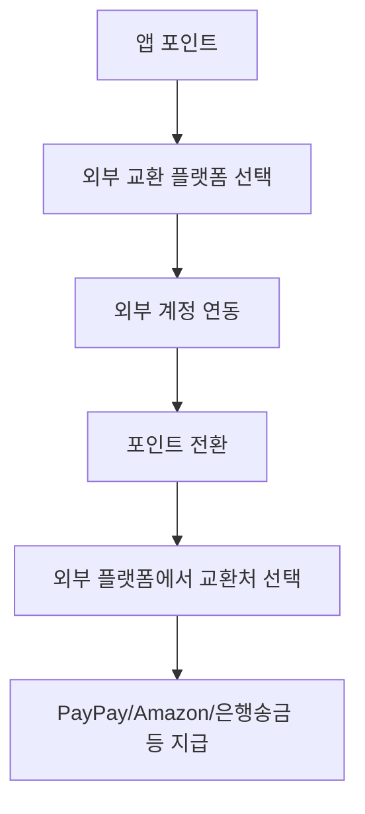

**추천 이유**

- 교환처를 빠르게 넓힐 수 있다.
- 은행송금도 앱이 직접 계좌를 들고 처리하지 않고 외부 플랫폼으로 넘길 수 있다.
- CS는 복잡해지지만 송금/계좌 정책 부담은 줄어든다.

### 은행송금 추가 흐름

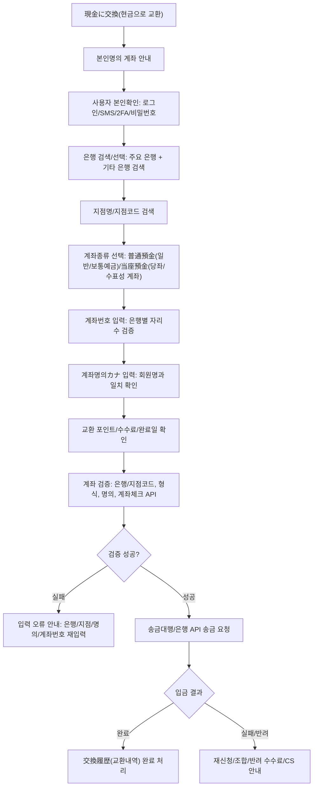

**필수 정책**

- 본인명의 계좌만 허용
- 동일 계좌 다계정 제한
- 계좌 변경 시 재인증
- ゆうちょ銀行(우체국은행) 변환 안내
- 송금 실패 시 재신청/반려 수수료 안내
- 은행별 완료일/수수료 표시

## 7. 추천 UI

실제 화면처럼 보이는 모바일 UI 목업은 HTML 보고서 7번 섹션에 반영했다.

실제 사례에서 확인되는 공통 패턴은 `은행 선택`, `지점 선택`, `계좌 정보 입력`, `확인`을 분리하는 방식이다.

| 예시 | 확인된 UI/입력 패턴 | 우리 UI 반영 |
|---|---|---|
| GMOポイ活 | 주요 은행 버튼, 기타 은행 검색, `支店名(지점명)` 검색 안내 | 빠른 선택 + 전체 은행 검색 + 지점 검색 화면 분리 |
| モッピー / ハピタス | 현금 교환 시 로그인 후 은행 계좌 등록/확인, 수수료·완료일 안내 | 입력 전 본인명의 안내, 확인 화면에 수수료/예정일 표시 |
| ゆうちょ銀行(우체국은행) | 기호/번호가 아니라 송금용 `店名(지점명)`, `預金種目(예금종류)`, `口座番号(계좌번호)` 확인 필요 | ゆうちょ 선택 시 별도 안내와 변환 도움말 링크 노출 |

### 포인트 교환 MVP 구성

- 상단: `ポイント交換 / 포인트 교환`, 도움말, 뒤로가기
- 잔액 카드: `保有ポイント / 보유 포인트`, 오늘 교환 가능 횟수
- 탭 없음: 1차 MVP는 포인트/기프트 교환만 제공
- 섹션 라벨: `交換先を選択 / 교환처 선택`
- 교환처 리스트: PayPay Money Light, Amazonギフトカード, dポイント, Ponta
- 교환처별 보조 문구: 최소 포인트, 즉시 발급 여부, 외부 ID 연동 여부, 출금 불가 주의
- 하단: `ポイント交換履歴 / 포인트 교환내역`

### 은행송금 추가 시 구성

단일 폼보다 단계형이 안전하다.

1. `銀行を選択 / 은행 선택`
   - 주요 은행 6개 빠른 선택: ゆうちょ(우체국), 三菱UFJ(미쓰비시UFJ), 三井住友(미쓰이스미토모), みずほ(미즈호), 楽天銀行(라쿠텐은행), PayPay銀行(PayPay은행)
   - 기타 은행은 `銀行名・金融機関コードを検索 / 은행명·금융기관코드 검색`
   - 사용자는 이름을 선택하고, 시스템은 금융기관코드를 저장

2. `支店を選択 / 지점 선택`
   - 선택한 은행명을 상단에 고정 표시
   - `支店名・支店コードを検索 / 지점명·지점코드 검색`
   - 검색 결과에서 지점을 선택하면 시스템이 지점코드를 저장

3. `口座情報 / 계좌 정보`
   - `口座種別 / 계좌종류`: `普通預金(보통예금)` 기본 선택, `当座預金(당좌)`, `貯蓄預金(저축)`은 옵션
   - `口座番号 / 계좌번호`: 보통 7자리 숫자, 은행별 형식 검증
   - `口座名義カナ / 계좌명의 카나`: 통장/은행 앱의 카나 표기와 동일하게 입력
   - `本人名義の口座のみ / 본인명의 계좌만` 안내

4. `確認 / 확인`
   - 은행명, 지점명/지점코드, 계좌종류, 마스킹 계좌번호, 명의 카나, 수수료, 완료 예정일 표시
   - `この内容で申請 / 이 내용으로 신청` CTA
   - 명의/지점 정보가 다르면 송금 실패 또는 반려될 수 있음을 안내

필수 입력 항목:

- 은행명 / 금융기관코드
- 지점명 또는 지점코드
- 계좌종류(기본 普通預金/일반·보통예금), 계좌번호
- 계좌명의カナ(계좌명의 가나), 본인명의 확인
- 교환 포인트, 수수료, 완료 예정일

## 8. 운영/제휴 체크

| 질문 | 답변 | 설계 반영 |
|---|---|---|
| 은행 선택이 6개뿐인가? | 아니다. 6개는 주요 은행 빠른 선택 예시다. 실제로는 `その他銀行を検索(기타 은행 검색)`에서 은행명/금융기관코드로 검색해야 한다. | 주요 은행 버튼 + 전체 은행 검색 |
| PayPal인가? | 목업의 은행 버튼은 PayPal이 아니라 `PayPay銀行(PayPay은행)`이다. PayPay는 일본 간편결제/포인트 생태계, PayPay銀行(PayPay은행)은 은행이다. PayPal은 별도 글로벌 결제 서비스다. | 은행 버튼은 `PayPay銀行(PayPay은행)`로 표기 |
| 계좌종류가 필요한가? | 필요하다. 일본 송금은 `普通預金(일반/보통예금)`, `当座預金(당좌/수표성 계좌)` 등 계좌종류/預金種目(예금종목)을 요구하는 경우가 있다. 포인트사이트는 보통 普通預金(일반/보통예금)만 허용하기도 한다. | 계좌종류 필드 노출, 기본값 普通預金(일반/보통예금) |
| 수수료가 있나? | 있을 수 있다. ハピタス처럼 직접 계좌입금에 교환 수수료를 명시하는 사례가 있고, 은행/교환처/대행사별로 다르다. | 교환 전 수수료와 완료 예정일 표시 |
| 본인확인은 어떻게 하나? | 서비스 로그인, SMS/메일 인증, 비밀번호/2FA, 외부 교환 플랫폼의 본인확인, 계좌명의カナ(계좌명의 가나)와 회원명 비교를 조합한다. PayPay 은행계좌 등록은 사전 本人確認(본인확인)이 필요하다고 안내한다. | 교환 신청 전 인증 단계와 명의 불일치 오류 처리 |
| 계좌 인증은 어떻게 하나? | 은행/지점코드 유효성, 계좌번호 자리수, 명의カナ(명의 가나) 형식, 계좌체크 API/송금대행사 검증, 실제 송금 결과를 단계적으로 확인한다. 모든 은행에서 실시간 명의조회가 되는 전제로 보면 위험하다. | 검증 실패/송금 실패/반려 상태값 운영 |
| 기프트 제휴는 어떻게 하나? | 개별 브랜드와 직접 계약하거나, デジコ/giftee Box/えらべるPay/DotMoney 같은 교환 플랫폼을 붙인다. MVP는 개별 제휴보다 플랫폼 연동이 빠르다. | 1차는 디지털기프트/교환 플랫폼 계약 우선 |
| 은행송금도 제휴가 필요한가? | 직접 은행별 제휴를 맺기보다 송금대행/결제대행/은행 API/자금이동업자 구조를 검토하는 게 일반적이다. 자체 송금은 정산, AML, 계좌오류 CS 부담이 크다. | 대행 솔루션 또는 DotMoney 경유 우선 |

## 9. API/법무 검토 링크

### 1차 MVP: 기프트/포인트 교환

| 선택지 | 검토 링크 | 앱에서 필요한 것 | 주의점 |
|---|---|---|---|
| 디지털기프트 플랫폼 | [デジコ](https://digi-co.net/faq), [giftee eGift System](https://en.giftee.co.jp/service/egiftsystem/), [giftee API 사례](https://giftee.co.jp/pressrelease20230228/) | 기프트 발급 API, 기프트 URL/코드 저장, 만료/재발급, 지급 상태 | 법인 계약, 발행수수료, 유저 CS 경계 확인 |
| 선택형 기프트 링크 | デジコ/giftee Box/えらべるPay류 | 유저에게 선택 링크 발급, 외부에서 교환처 선택 | 앱 내 UX 통제는 낮지만 교환처 확장이 빠름 |
| 개별 브랜드 직접 제휴 | Amazon, 편의점, 외식, 포인트 사업자별 B2B 계약 | 브랜드별 API/CSV/재고/정산/장애 대응 | MVP에는 무겁고 브랜드별 계약/운영 부담이 큼 |

### 2차: DotMoney/디지털기프트 확장

| 방식 | 검토 링크 | 앱에서 필요한 것 | 운영 포인트 |
|---|---|---|---|
| DotMoney 제휴 | [Moneywalk → DotMoney 예시](https://d-money.jp/earn/exchange/detail/1242), [Powl DotMoney 도움말](https://pages.powl.jp/help/d-money/) | 외부 계정 연동, 전환 신청, 완료/실패 상태 표시 | 은행송금까지 확장 가능. 문의 책임 경계 필요 |
| PayPay Money Light | [Powl PayPay 공지](https://paypay.ne.jp/notice/20220831/c-zndk-api/), [TikTok Lite PayPay 기사](https://paypay.ne.jp/article/tiktoklite/) | PayPay 교환처 노출, 출금 불가 안내, 지급 상태 관리 | PayPay 심사/제휴/API 조건 확인 필요 |

### 은행 데이터/API/계좌검증

| 필요 기능 | 후보 링크 | 역할 | 주의점 |
|---|---|---|---|
| 은행/지점 마스터 | [BankcodeJP API](https://bankcode-jp.com/faq), [銀行くん API](https://bank.teraren.com/), [AGREX WebAPI](https://www.agrex.co.jp/service/detail/api-finance.html) | 금융기관코드, 지점코드, 지점명 검색/보정 | 계좌 존재/명의 일치까지 보장하지는 않음 |
| 은행 API 연동 | [MUFG API 서비스 예시](https://direct.bk.mufg.jp/fw/ib_help/api.html), 각 은행 API/오픈뱅킹 포털 | 은행 계정 연동, 계좌 선택, 이용자 동의 | 은행별 제휴·심사 필요. 공통 API 하나로 전체 은행을 처리하기 어렵다 |
| 송금대행 | [GMO-PG](https://www.gmo-pg.com/service/soukin/), [GMO Epsilon](https://www.epsilon.jp/guidance/money_transfer.html), [WELLNET](https://www.wellnet.co.jp/business-payment/rapid-remittance/index.html) | 대량 송금, 송금 결과, 반려 처리, 정산 | 계약 심사, 수수료, AML/자금이동업 구조 검토 필요 |

### 본인확인/eKYC

| 후보 | 링크 | 역할 | 사용 시점 |
|---|---|---|---|
| Polarify eKYC | https://www.polarify.co.jp/ekyc/ | 犯収法 방식에 맞춘 온라인 본인확인 | 은행송금, 고액 교환, 부정 의심 계정 |
| LIQUID eKYC | https://liquidinc.asia/liquid-ekyc/ekyc-products/ | IC칩/브라우저/앱 기반 본인확인, 결과 API 연계 | 본인확인 자동화가 필요할 때 |
| TRUSTDOCK | https://biz.trustdock.io/news/docomo-ekyc-api-app | eKYC/법인확인/신원확인 API | 본인확인·법인확인 워크플로우 구축 |

### 해외 사업자 법무 체크

무료로 돈을 주는 앱테크도 검토가 필요한 이유:

유저가 포인트를 구매하지 않고 광고시청, 걷기, 미션 수행 보상으로 받는 구조라면 `선불식 지급수단` 이슈는 낮아질 수 있다. 다만 개인정보 수집, 광고/리워드 표시, 부정사용 제재, 현금성 송금, 외부 포인트 전환은 별도 법무/운영 검토가 필요하다.

| 쟁점 | 검토 내용 | 근거/링크 |
|---|---|---|
| 포인트/기프트 규제 | 유저가 돈을 내고 사는 포인트/전자기프트는 資金決済法상 前払式支払手段 이슈가 생길 수 있다. 무료 리워드 포인트라도 설계에 따라 법무 확인 필요. | [FSA FinTech Support Desk](https://www.fsa.go.jp/news/27/sonota/20151214-2.html), [FSA prepaid instruments](https://www.fsa.go.jp/en/measures/gift_certificates/index.html) |
| 현금송금/은행송금 | 타인에게 자금을 이전하는 구조는 은행업/資金移動業/송금대행 계약 검토가 필요하다. 자체 송금보다 등록 사업자/대행사 이용이 안전하다. | [FSA 자금결제 의견 문서](https://www.fsa.go.jp/news/21/kinyu/20100223-1/00.pdf) |
| AML/KYC | 현금성 리워드, 고액 교환, 은행송금은 犯収法상 본인확인/거래목적/기록보존/의심거래 대응이 문제될 수 있다. | [FSA 온라인 본인확인 Q&A](https://www.fsa.go.jp/common/law/guide/kakunin-qa.html) |
| 개인정보/국외 이전 | 일본 이용자 개인정보, 계좌정보, 본인확인 자료를 한국/해외 서버에서 처리하면 APPI, 위탁/제3자 제공/국외 이전 고지 검토 필요. | [PPC Laws and Policies](https://www.ppc.go.jp/en/legal/), [APPI 영문 번역](https://www.japaneselawtranslation.go.jp/en/laws/view/130/en) |
| 해외 법인 계약 | 일본 기프트/송금/eKYC 사업자는 일본 법인 계약, 일본 내 정산 계좌, 세금/인보이스, 반사회세력 배제 조항을 요구할 수 있다. | 각 벤더 계약 심사 확인 필요 |

### 일본 출시 전 필수 문서/정책

| 문서 | 일본 앱테크에서 필요한 항목 | 주의점 |
|---|---|---|
| プライバシーポリシー | 수집 항목, 이용 목적, 광고ID/위치/걸음수/계좌정보/eKYC 정보, 제3자 제공, 위탁, 국외 이전, 보관기간, 문의창구 | 한국 서버나 글로벌 SaaS로 전송하면 국외 이전 고지/동의 구조 확인 |
| 利用規約 | 포인트 적립 조건, 교환 조건, 유효기간, 취소/회수, 부정사용 제재, 계정 정지, 송금 실패/수수료, 책임 범위 | 포인트가 재산권인지, 서비스 임의 변경/종료 시 처리 기준을 명확히 해야 함 |
| リワード表示ルール | “얼마를 받을 수 있는지”, “언제 지급되는지”, “출금 가능한지”, “수수료/최소 교환액”을 명확히 표시 | 과장 표시, 조건 누락, 스텔스 마케팅성 리뷰/추천 보상은 [景品表示法](https://www.japaneselawtranslation.go.jp/en/laws/view/4860) 검토 |
| 本人確認/不正対策ポリシー | 본인명의 계좌 제한, 동일 계좌 다계정 제한, 고액/반복 교환 모니터링, 계좌 변경 시 재인증 | 은행송금이나 현금성 교환이 들어가면 KYC/AML 수준을 높여야 함 |
| 特定商取引法 표기 | 유료 상품, 구독, 인앱 결제, 광고주 상품 판매/중개가 있으면 사업자 정보/가격/환불 등 표기 검토 | [CAA Specified Commercial Transactions Act Guide](https://www.no-trouble.caa.go.jp/foreignlanguage/english/) 확인 |

법무 메모: 위 내용은 제품/사업 검토용 이슈 목록이며 법률 자문이 아니다. 일본 출시 전에는 일본 변호사/행정서사/결제대행사와 구조별로 資金決済法, 犯収法, 개인정보보호법, 세무/정산을 확인해야 한다.

## 10. 참고 링크

- Cashwalk App Store: https://apps.apple.com/jp/app/cashwalk-%E6%AD%A9%E3%81%84%E3%81%A6%E3%83%9D%E3%82%A4%E3%83%B3%E3%83%88/id6748212428
- Cashwalk 공식: https://cashwalk.jp/
- Cashwalk JP 공식 FAQ: https://sites.google.com/cashwalk.io/cashwalk-faq/faq
- Moneywalk App Store: https://apps.apple.com/jp/app/moneywalk-step-counter-rewards/id1638253339
- Moneywalk DotMoney: https://d-money.jp/earn/exchange/detail/1242
- TikTok Lite PayPay 공식: https://paypay.ne.jp/article/tiktoklite/
- トリマ PayPay/Digital Gift 후기: https://www.kotablo.com/entry/trima-paypay
- クラシルリワード 교환: https://www.rewards.kurashiru.com/cashback
- Powl PayPay 공식 공지: https://paypay.ne.jp/notice/20220831/c-zndk-api/
- Powl PR TIMES: https://prtimes.jp/main/html/rd/p/000000205.000013425.html
- ONE 레시트 앱 후기: https://point.kasegus.net/one.html
- aruku& 공식 도움말: https://help.arukuto.jp/webview/arukuto_help/qa/arukuto_point_exchange.html
- CODE DotMoney 연동: https://prtimes.jp/main/html/rd/p/000000092.000004624.html
- Uvoice 교환처 도움말: https://browser.support.u-voice.net/hc/ja/articles/26102235858073
- ハピタス 현금 교환: https://sp.hapitas.jp/exchange/indivisible/bank
- ハピタス 은행/지점 선택 후기: https://manepla.com/hapitas-point-change/
- モッピー 은행송금 도움말: https://pc.moppy.jp/help/detail/?id=44
- モッピー 교환처: https://pc.moppy.jp/cashback/
- ポイントタウン 楽天銀行 교환: https://www.pointtown.com/exchange/bank/rakuten
- ポイントタウン ゆうちょ銀行 교환: https://www.pointtown.com/exchange/bank/jp
- GMOポイ活 현금 교환: https://colleee.net/support/?p=281
- デジコ FAQ/API/수수료: https://digi-co.net/faq
- giftee eGift System: https://en.giftee.co.jp/service/egiftsystem/
- giftee API 발급 사례: https://giftee.co.jp/pressrelease20230228/
- BankcodeJP API: https://bankcode-jp.com/faq
- 銀行くん API: https://bank.teraren.com/
- AGREX 금융기관 검색 WebAPI: https://www.agrex.co.jp/service/detail/api-finance.html
- MUFG API 서비스 예시: https://direct.bk.mufg.jp/fw/ib_help/api.html
- GMO-PG 송금 서비스: https://www.gmo-pg.com/service/soukin/
- GMO Epsilon 송금 서비스: https://www.epsilon.jp/guidance/money_transfer.html
- WELLNET 송금 서비스: https://www.wellnet.co.jp/business-payment/rapid-remittance/index.html
- Polarify eKYC: https://www.polarify.co.jp/ekyc/
- LIQUID eKYC: https://liquidinc.asia/liquid-ekyc/ekyc-products/
- TRUSTDOCK eKYC/API 사례: https://biz.trustdock.io/news/docomo-ekyc-api-app
- FSA 온라인 본인확인 Q&A: https://www.fsa.go.jp/common/law/guide/kakunin-qa.html
- FSA FinTech Support Desk: https://www.fsa.go.jp/news/27/sonota/20151214-2.html
- FSA prepaid payment instruments: https://www.fsa.go.jp/en/measures/gift_certificates/index.html
- FSA 資金決済法 관련 의견 문서: https://www.fsa.go.jp/news/21/kinyu/20100223-1/00.pdf
- PPC 개인정보보호 법령/정책: https://www.ppc.go.jp/en/legal/
- APPI 영문 번역: https://www.japaneselawtranslation.go.jp/en/laws/view/130/en
- 景品表示法 영문 번역: https://www.japaneselawtranslation.go.jp/en/laws/view/4860
- 特定商取引法 영문 안내: https://www.no-trouble.caa.go.jp/foreignlanguage/english/
- Zengin-Net 2026년 3월 금융기관/지점 통계: https://www.zengin-net.jp/en/zengin_net/statistical_data/pdf/statistical_data_202603.pdf
- MUFG 계좌종류 코드 예시: https://www.bk.mufg.jp/ebusiness/j/gplus/pdf/cs/shoshikisyu02_01_appendix2.pdf
